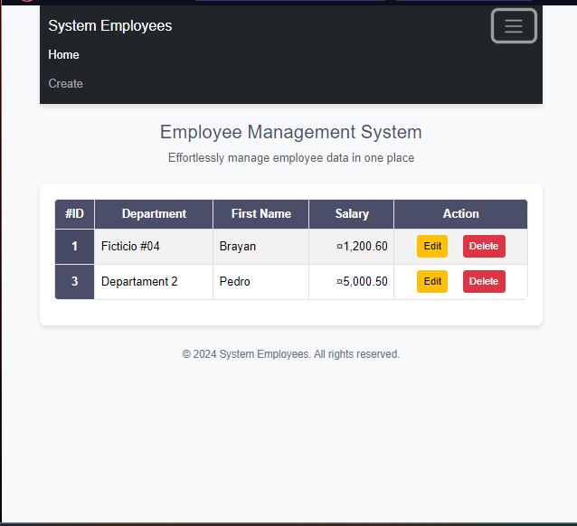

# Spring Boot CRUD Application

This project is a CRUD (Create, Read, Update, Delete) system for managing employees using **Spring Boot**. This README provides an overview of the project structure and the purpose of each component. Additionally, it includes a screenshot showing the visual result of the practice.
## Project Structure

The project is organized as follows:

```
src/
├── main/
│   ├── java/
│   │   └── com.brayanalmengor04.employees/
│   │       ├── controller/
│   │       │   └── IndexController.java
│   │       ├── entities/
│   │       │   └── Employees.java
│   │       ├── repository/
│   │       │   └── EmployeesRepository.java
│   │       ├── service/
│   │       │   ├── EmployeesService.java
│   │       │   └── EmployeesServiceImpl.java
│   │       └── EmployeesApplication.java
│   ├── resources/
│   │   ├── static/
│   │   ├── templates/
│   │   ├── application.properties
│   │   └── logback-spring.xml
│   └── webapp/
│       ├── WEB-INF/
│       │   └── jsp/
│       │       ├── template/
│       │       │   ├── footer.jsp
│       │       │   ├── header.jsp
│       │       │   ├── navbar.jsp
│       │       ├── create.jsp
│       │       ├── edit.jsp
│       │       └── index.jsp
├── test/
```

### Description of Packages and Files

#### 1. **`controller` Package**
- **`IndexController.java`**: Main controller that handles HTTP requests and redirects to JSP views. Contains methods for listing, creating, updating, and deleting employees.

#### 2. **`entities` Package**
- **`Employees.java`**: Class representing the employee entity with its respective attributes (e.g., `id`, `name`, `salary`, etc.) and JPA annotations to map the database table.

#### 3. **`repository` Package**
- **`EmployeesRepository.java`**: Interface extending `JpaRepository`. Provides default CRUD methods for database interaction.

#### 4. **`service` Package**
- **`EmployeesService.java`**: Interface defining business logic methods related to employees.
- **`EmployeesServiceImpl.java`**: Implementation of `EmployeesService`. Contains business logic and calls the repository for operations.

#### 5. **Main Class**
- **`EmployeesApplication.java`**: Entry point of the Spring Boot project. Contains the `main` method to start the application.

#### 6. **`resources` Directory**
- **`static/`**: Static files such as images, JavaScript, or CSS.
- **`templates/`**: HTML/JSP template files, though not used here since views are in `WEB-INF/jsp`.
- **`application.properties`**: Configuration file for the application, defining server context, database settings, and more.
- **`logback-spring.xml`**: Configuration for logging.

#### 7. **`webapp` Directory**
- **`WEB-INF/jsp/`**: Contains JSP views used in the project:
  - **`template/`**: Common templates such as `header.jsp`, `navbar.jsp`, and `footer.jsp`.
  - **`create.jsp`**: Form to add a new employee.
  - **`edit.jsp`**: Form to edit an existing employee.
  - **`index.jsp`**: Main page listing all employees.

## Added Dependencies

To enable JSP and JSTL functionalities, the following dependencies were included:

```xml
<dependencies>
    <!-- JSP Dependency -->
    <dependency>
        <groupId>org.apache.tomcat.embed</groupId>
        <artifactId>tomcat-embed-jasper</artifactId>
    </dependency>

    <!-- JSTL Dependency for Special Tags in JSP -->
    <dependency>
        <groupId>jakarta.servlet.jsp.jstl</groupId>
        <artifactId>jakarta.servlet.jsp.jstl-api</artifactId>
    </dependency>

    <!-- JSTL Implementation -->
    <dependency>
        <groupId>org.glassfish.web</groupId>
        <artifactId>jakarta.servlet.jsp.jstl</artifactId>
    </dependency>
</dependencies>
```

## Visual Result

Below is a screenshot of the CRUD application in action:



## Technologies Used

- **Spring Boot**: Main framework for application development.
- **JPA/Hibernate**: For data persistence.
- **JSP**: For view rendering.
- **MySQL**: Relational database.
- **Maven**: Dependency management.

## Execution Instructions

1. Clone this repository.
2. Configure your database in the `application.properties` file.
3. Run the application from `EmployeesApplication.java`.
4. Access the system from your browser at `http://localhost:8080/employees`.

---

Thank you for reviewing this project! If you have any questions, feel free to open an issue.
